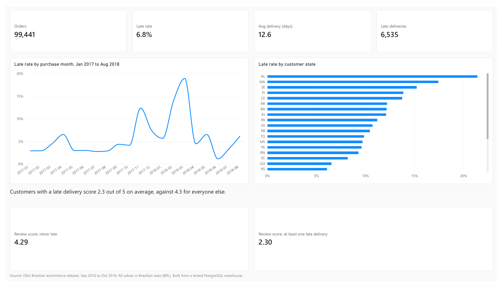
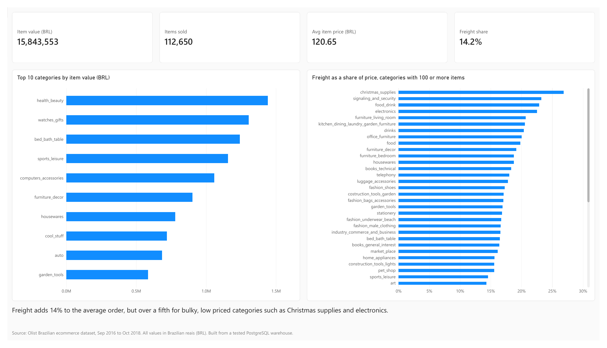
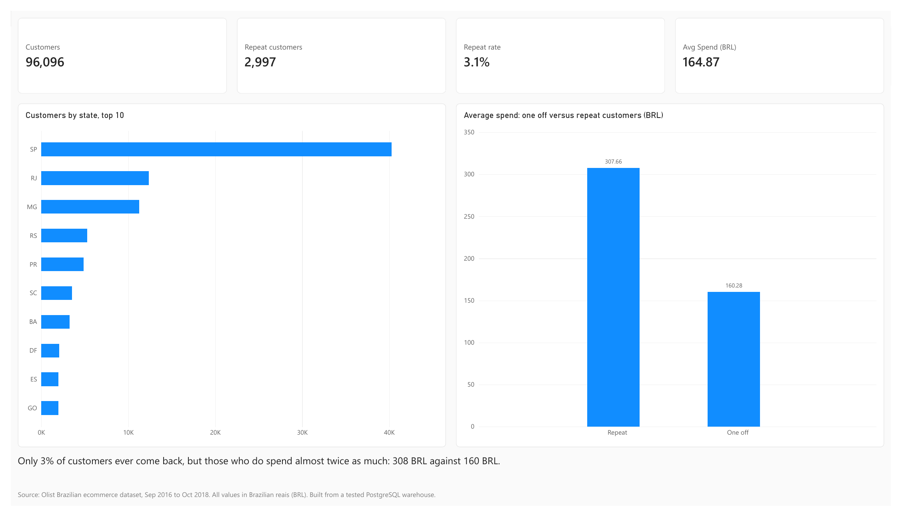
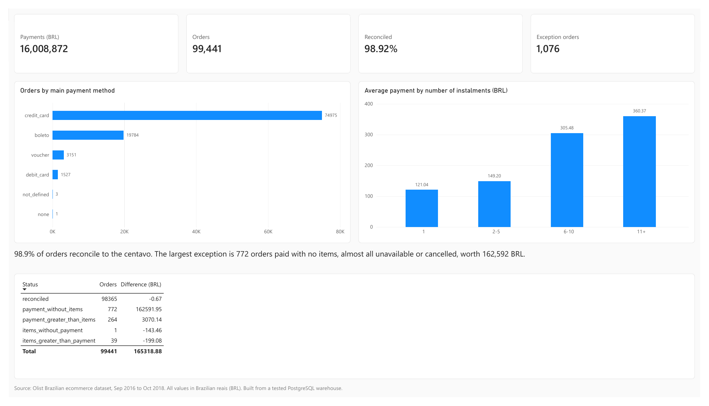

# Logistics Data Platform

A PostgreSQL data warehouse built from the Olist Brazilian ecommerce dataset, with a Power BI dashboard on top. One command rebuilds everything from the raw CSV files, data quality checks run between every stage, and GitHub Actions rebuilds and tests the whole warehouse on every push.

[](https://github.com/athi04/logistics-data-platform/actions/workflows/pipeline.yml)

## What the data shows

Olist is a Brazilian marketplace. The dataset covers 99,441 orders placed between September 2016 and October 2018. All money values are in Brazilian reais (BRL).

| Finding | Figure |
|---|---|
| Orders delivered after the estimated date | 6.8% of delivered orders |
| Late rate around Black Friday 2017, and at its March 2018 peak | 12.4% and 19.0%, against about 3% in a normal month |
| Late rate by customer state | from 2.8% (Amazonas) to 21.4% (Alagoas) |
| Average review score, customers with no late delivery | 4.29 out of 5 |
| Average review score, customers with at least one late delivery | 2.30 out of 5 |
| Customers who ever ordered again | 3.1% |
| Average spend, repeat customers against customers who ordered once | 307.66 against 160.28 BRL |
| Freight as a share of what customers paid | 14.2% overall, 26.8% for Christmas supplies |
| Orders whose payments match their items to the centavo | 98.92% |

The late delivery and review score figures show a strong association, not proof that lateness causes low scores. Other factors, such as distance from the sellers, could affect both.

## Dashboard

Four Power BI pages, built only from the warehouse's reporting tables. The file is [`powerbi/logistics.pbix`](powerbi/logistics.pbix), and there is a [PDF export](docs/dashboard.pdf) for anyone without Power BI.

**Delivery:** how often orders arrive late, when and where.


**Sales:** which categories earn the most, and where freight costs bite.


**Customers:** who buys and whether they come back.


**Payments:** how customers pay, and the reconciliation of payments against items.


## How it works

```text
9 Olist CSVs
   │  Python, loaded with PostgreSQL COPY
   ▼
raw        the files as delivered                    ── quality checks
   ▼
staging    cleaned, one row per real thing           ── quality checks
   ▼
analytics  star schema: 5 dimensions, 4 facts,
           plus an order summary with reconciliation ── quality checks
   ▼
marts      one table per business question           ── quality checks
   ▼
Power BI
```

Each layer reads only from the layer below it. Power BI reads only the marts, so every business rule (what counts as late, what counts as reconciled) is defined once in SQL and tested, rather than recalculated in the dashboard.

Every step is safe to rerun. Tables that other tables depend on are updated in place; tables nothing depends on are emptied and rebuilt inside a transaction, so a failed run leaves the previous data intact.

## Problems found and fixed along the way

Building the warehouse meant checking every figure, and several were wrong at first.

**1,292 orders were counted as late when they were not.** Olist stores every estimated delivery time as midnight. Comparing timestamps meant an order delivered at 2pm on the promised day counted as late. Comparing dates instead cut the late count from 7,827 to 6,535.

**Joining items to payments would have overstated sales by 722,990.61 BRL.** An order with two items and three payments becomes six rows in a direct join. Items and payments are summed per order first, then joined.

**Every customer looked like they had only ordered once.** Olist issues a new `customer_id` for every order. The customer tables use `customer_unique_id`, which identifies the person, and that revealed the 3.1% of customers who came back.

**The same SQL gave different answers on different machines.** City names for each ZIP prefix are chosen by the most common value, and one tie was broken by the server's language settings. Fixing the sort order with `COLLATE "C"` made results identical everywhere.

**Rebuilding from empty found gaps the live database hid.** The schema script never created the `staging` and `analytics` schemas; the live database only had them because they were once created by hand.

**Loading speed.** In an early version, loading with `COPY` took 23.8 seconds against 128.7 seconds row by row, about 5.4 times faster.

## Data quality and testing

**Quality checks** ([`sql/07_data_quality_checks.sql`](sql/07_data_quality_checks.sql)) run between pipeline stages. Each returns a count of failing rows.

* 15 critical checks, such as no rows lost between layers and money totals preserved through every layer. Any failure stops the pipeline before bad data reaches the next layer.
* 12 warnings for known problems in the source data, reported on every run, such as 1,359 orders handed to the carrier before their payment was approved, and 8 orders marked delivered with no delivery date.

**Tests:** 106 pytest tests check the code and the results: that the configuration is consistent, and that row counts, money totals, reconciliation and delivery categories match the [reference figures](docs/reference_figures.md) exactly. Database tests skip cleanly when no database is running.

**Run log:** every pipeline run is recorded in `meta.pipeline_runs` with its status, duration, rows loaded and number of warnings.

**Continuous integration:** on every push, GitHub Actions starts a fresh PostgreSQL 17, builds the whole warehouse from the source files and runs every test.

The warehouse has been rebuilt from scratch on Linux, on Windows 11 and in CI on a fresh Ubuntu machine, with identical results.

## Running it yourself

You need Python 3.14, Docker and the GitHub CLI (`gh`).

```bash
git clone https://github.com/athi04/logistics-data-platform.git
cd logistics-data-platform

# Source data: from this repo's data release, or download "Brazilian E-Commerce
# Public Dataset by Olist" from Kaggle and unzip the CSVs into data/
gh release download data-v1 --pattern olist-data.zip
unzip olist-data.zip

cp .env.example .env
python -m venv .venv
source .venv/bin/activate          # Windows: .venv\Scripts\Activate.ps1
pip install -r requirements.txt

docker compose up -d
python src/run_pipeline.py         # builds everything, about a minute
pytest                             # 106 tests
```

## Project structure

```text
sql/
  00_create_run_log.sql            run history table
  01_create_schemas.sql            raw, staging, analytics, marts
  02_create_raw_tables.sql
  03_create_staging_tables.sql
  04_create_analytics_dimensions.sql
  05_create_analytics_facts.sql    includes order_summary and reconciliation
  06_create_marts.sql
  07_data_quality_checks.sql
src/
  run_pipeline.py                  runs every step in order
  load_raw.py                      loads the CSVs, one entry per table
  quality_checks.py                runs the checks in 07
tests/                             pytest suite
powerbi/logistics.pbix             the dashboard
docs/                              reference figures, dashboard PDF and images
.github/workflows/pipeline.yml     CI
```

## Limitations

* The data is a fixed historical snapshot, so the pipeline is built to rebuild reliably rather than to load new data incrementally.
* 42 raw coordinates lie outside Brazil and are included in the ZIP prefix averages, so a few locations may be slightly off. This is reported as a warning on every run.
* Customer location comes from the state of their most recent order; 39 customers ordered from more than one state.

## Data source

[Brazilian E-Commerce Public Dataset by Olist](https://www.kaggle.com/datasets/olistbr/brazilian-ecommerce), published under CC BY-NC-SA 4.0. Olist owns the data; this project uses it for a portfolio, not for any commercial purpose.
